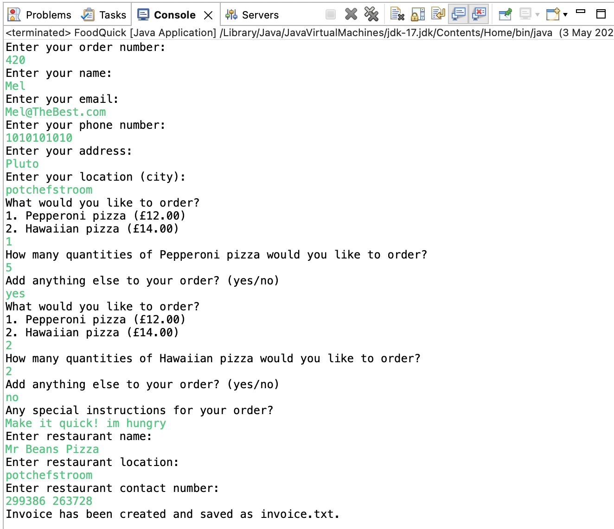
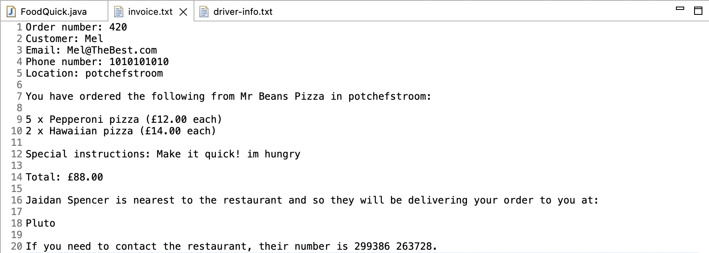

# FoodQuick-Delivery-Application

## FoodQuick Delivery Menu


## FoodQuick Invoice 


## Description

The "FoodQuick Delivery Application" is an advanced food delivery system designed to streamline the order and delivery process. This application is a capstone project that showcases the use of object-oriented programming principles, defensive programming with the incorporation of try-catch blocks, and efficient code structuring.

For a detailed understanding of the program's structure and database layout, please view the [FoodQuick Diagram PDF](FoodQuick%20Diagram.pdf). It provides a visual representation of the relationships between the different sets of data.

## Key Features 

1. Enum Menu: A dynamic way of adding items to the menu, making it more scalable and manageable.
2. Code Refactoring: The primary codebase has been refactored to distribute responsibilities. This ensures that the main method does not handle all operations, promoting better code readability and maintenance.
3. Defensive Programming: Implemented three try-catch blocks to manage potential exceptions, ensuring the application runs without unexpected crashes.
4. Object-Oriented Design: The application is broken down into separate classes (Driver.java, Restaurant.java, Order.java, Customer.java) to encapsulate specific behaviors and data. This abstraction allows for a clearer representation of real-world entities and relationships.
5. Efficient Driver Selection: The application reads from driver.txt to find the most suitable driver, considering factors such as load and location. This ensures that orders are delivered in the most efficient manner possible.
6. Invoice Generation: After each order, an invoice is generated, capturing essential details. This invoice is saved to Invoice.txt and can be presented to the user.

## Table of Contents

- [Installation](#installation)
- [Usage](#usage)
- [Credits](#credits)

## Installation

Follow the steps below to install, configure, and get the project running locally on your system.

```bash
# Copy the following code in your terminal

# Clone the repository
git clone https://github.com/M311HAN/FoodQuick-Delivery-Application.git

# Navigate into the cloned directory
cd FoodQuick-Delivery-Application

# To view and run the project, open the relevant java files with a suitable Java IDE or compiler
```
## Usage

To effectively use the FoodQuick Delivery Application:

1. Start the application and follow the on-screen prompts.
2. Users can select from a dynamic menu to place their orders.
3. The system will automatically select the most appropriate driver based on location and load by reading from Drivers.txt.
4. Upon completion, an invoice will be generated and saved to Invoice.txt.

The development of this application was backed by thorough planning. Pseudocode was utilized to layout the core logic, while a UML class diagram was created to define the relationships between various classes and their functions.

## Credits

This project was created by Melihhan (https://github.com/M311HAN). For more details, questions, or feedback, reach out through GitHub.
